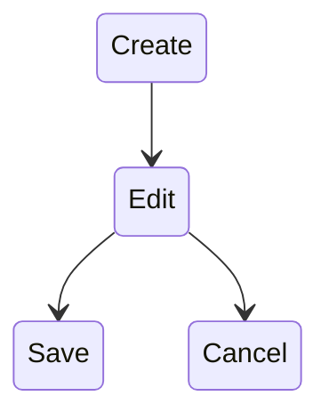
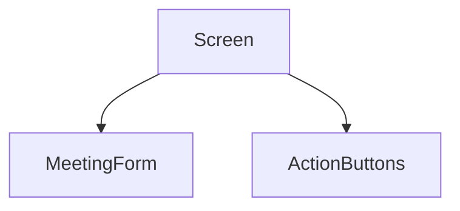

### Step 1 — Install and create one drawing

The plugin is available directly from Obsidian Community Plugins. Once installed, you can create a new Excalidraw file and start sketching inside your vault.

Good starting guides:

- [Official Excalidraw Obsidian Wiki](https://excalidraw-obsidian.online/wiki/welcome?utm_source=chatgpt.com)
- [Getting Started with Excalidraw in Obsidian](https://obsidian.rocks/getting-started-with-excalidraw/?utm_source=chatgpt.com)
- [Plugin GitHub Repository](https://github.com/zsviczian/obsidian-excalidraw-plugin?utm_source=chatgpt.com)
- [Video Tutorial (beginner-friendly)](https://www.youtube.com/watch?v=eemtbdcik3I&utm_source=chatgpt.com)

The first goal is not beauty.

Just learn:

```
Rectangle
Arrow
Text
Move objects
Resize objects
```

That's enough for 80% of software diagrams.

---

### Step 2 — Use it only for TUI wireframes

Don't try mind maps.  
Don't try architecture.  
Don't try visual PKM wizardry.

Just draw screens.

Example exercise:

┌─────────────────────────────┐  
│ Create Meeting                                                    │  
├─────────────────────────────┤  
│ Type [ ]                                                                 │  
│ Duration [ ]                                                          │  
│ Drift [ ]                                                                 │  
├─────────────────────────────┤  
│ Clear Save                                                            │  
└─────────────────────────────┘

Literally:

```
Rectangle
Rectangle
Text
Text
Text
```

Done.

---

### Step 3 — Draw one FSM

You already think in FSMs.

Something like:

Create  
|  
v  
Edit  
|  
+----> Cancel  
|  
v  
Save

Honestly, I think FSM diagrams will feel natural to you almost immediately.

---
You can embed both Excalidraw and Mermaid directly into normal Markdown notes.

### Mermaid

Directly inside a note:



Obsidian renders it automatically.

This is fantastic for:

- FSMs
- Flowcharts
- Component trees
- Architecture diagrams

Example:



---

### Excalidraw

Suppose you create: `create-meeting.excalidraw`
Then inside any note: `![[create-meeting.excalidraw]]`
and the drawing appears embedded in the note. The plugin explicitly supports embedding Excalidraw drawings into Markdown documents.

So you can have something like:
```markdown
# Create Meeting Screen  
  
Purpose:  
Create a new meeting.  
  
## UI Sketch  
  
![[create-meeting.excalidraw]]  
  
## State  
  
- meeting_type  
- duration  
- drift  
  
## Events  
  
- Tab  
- Enter  
- Esc
```
Which is honestly a very nice workflow for software design notes.

---

For _your_ TUI course notes, I would probably do this:

Week 1/  
├── Lesson 1 - Terminal Grid.md  
├── Lesson 2 - Areas and Rectangles.md  
├── diagrams/  
│ ├── terminal-grid.excalidraw  
│ ├── menu-layout.excalidraw  
│ └── screen-tree.excalidraw

Use:

- **Mermaid** for FSMs and flow logic.
- **Excalidraw** for screens and layouts.

That division matches the way you already think:
	Behavior            →Mermaid
	Visual Structure    →Excalidraw